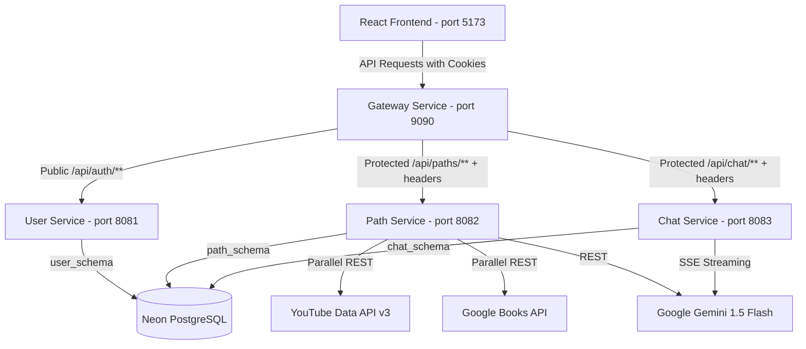

# Pathways — AI-Powered Learning Curriculum & Assistant

Pathways is a personalized learning path generator and study assistant. Users enter any skill and target proficiency, and the system instantly generates a week-by-week learning curriculum enriched with real curated resources (YouTube tutorials, reference books, and official documentation) and opens a persistent, context-aware AI chat guide.

This is a portfolio microservice project built with Spring Boot, Spring Cloud Gateway, React, and Neon serverless PostgreSQL, demonstrating clean distributed system design, parallel async API orchestration, and resilient fallback engineering.

---

## 🚀 Key Features

* **AI Curriculum Orchestration:** Generates structured learning timelines tailored to the user's proficiency level and milestones.
* **Parallel Resource Enrichment:** Concurrently fetches relevant YouTube tutorials and Google Books references using Spring `@Async` threads to minimize latency.
* **Context-Aware Study Assistant:** An AI side-drawer assistant that understands the current week, active topics, and student progress to deliver contextually relevant explanations, code snippets, and custom quizzes.
* **Stateless Edge Security:** Implements gateway-level JWT decryption and cookie verification, injecting user contexts downstream to keep backend microservices completely stateless.
* **Resilient Outage Fallbacks:** Gracefully falls back to high-fidelity offline templates if Gemini API credentials fail/expire, and falls back to direct YouTube query links if daily API limits are exhausted.

---

## 🏗️ System Architecture



---

## 🗄️ Database Schema Design (ER)

The project utilizes a single PostgreSQL instance and organizes boundaries into three separate schemas:

### 1. `user_schema` (User Service)
* **`users` Table:**
  * `id` (UUID, Primary Key)
  * `username` (VARCHAR, Unique, Not Null)
  * `email` (VARCHAR, Unique, Not Null)
  * `password` (VARCHAR, Encrypted)
  * `created_at` (TIMESTAMP)
* **`refresh_tokens` Table:**
  * `id` (UUID, Primary Key)
  * `user_id` (UUID, Foreign Key)
  * `token` (VARCHAR, Unique, Not Null)
  * `expiry_date` (TIMESTAMP, Not Null)
  * `revoked` (BOOLEAN)

### 2. `path_schema` (Path Service)
* **`learning_paths` Table:**
  * `id` (UUID, Primary Key)
  * `user_id` (UUID, Not Null) - *Propagated from Gateway headers*
  * `skill` (VARCHAR, Not Null)
  * `level` (VARCHAR, Not Null)
  * `goal` (VARCHAR)
  * `completed_topics_count` (INTEGER)
  * `total_topics_count` (INTEGER)
  * `is_completed` (BOOLEAN)
  * `created_at` (TIMESTAMP)
* **`weeks` Table:**
  * `id` (UUID, Primary Key)
  * `path_id` (UUID, Foreign Key)
  * `week_number` (INTEGER, Not Null)
  * `theme` (VARCHAR, Not Null)
  * `objectives` (TEXT/JSON)
* **`topics` Table:**
  * `id` (UUID, Primary Key)
  * `week_id` (UUID, Foreign Key)
  * `title` (VARCHAR, Not Null)
  * `description` (TEXT)
  * `is_completed` (BOOLEAN)
  * `sequence_number` (INTEGER)
* **`resources` Table:**
  * `id` (UUID, Primary Key)
  * `topic_id` (UUID, Foreign Key)
  * `type` (VARCHAR: `YOUTUBE`, `BOOK`, `DOCUMENT`)
  * `title` (VARCHAR)
  * `url` (VARCHAR(1024))
  * `description` (TEXT)
  * `thumbnail_url` (VARCHAR(1024))

### 3. `chat_schema` (Chat Service)
* **`chat_messages` Table:**
  * `id` (UUID, Primary Key)
  * `path_id` (UUID, Not Null)
  * `sender` (VARCHAR: `USER`, `ASSISTANT`)
  * `content` (TEXT, Not Null)
  * `created_at` (TIMESTAMP, Not Null)

---

## 🛠️ Technology Stack

### Backend
* **Core Framework:** Spring Boot 3.x
* **Language:** Java 17+
* **Routing Edge:** Spring Cloud Gateway (Port 9090)
* **Security:** Spring Security (Stateless, cookie-based JWT verification)
* **Reactive Elements:** Spring WebFlux (WebClient for streaming SSE chat tokens)
* **Data Layer:** Spring Data JPA + Hibernate (Auto-creation of schemas on boot)
* **Database:** Neon Serverless PostgreSQL

### Frontend
* **Core:** React 18, Vite
* **Styling:** Tailwind CSS 3, Framer Motion (for timeline layouts and interactive card transitions)
* **Icons:** Lucide React
* **State Management:** Zustand
* **API Client:** Axios (configured with credentials and response interceptors to handle automatic token refreshing)

---

## ⚡ Local Setup

### Prerequisites
1. Java 17+ installed.
2. Node.js installed.
3. A running PostgreSQL instance (or Neon connection string).

### Running Locally
To launch all backend microservices and the React client concurrently:

1. **Launch Services:**
   In a PowerShell terminal run:
   ```powershell
   .\start-services.ps1
   ```
   This script compiles each Java service using the local Maven bundle, re-packages the jars, and starts all backends alongside the React server (`localhost:5173`) in background jobs.

2. **Clean Shutdown:**
   To stop all active services and release ports:
   ```powershell
   .\stop-services.ps1
   ```
